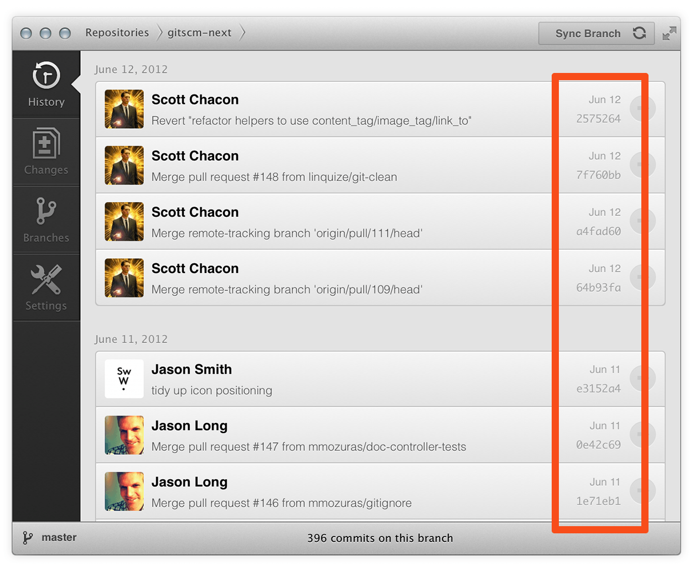

+++
title = "数据保证"
weight = 40
type = "docs"
date = 2023-07-26T09:47:23+08:00
description = ""
isCJKLanguage = true
draft = false
+++

## Data Assurance - 数据保证

​	Git使用的数据模型确保了项目中每一位的密钥完整性。每一个文件和提交都被校验过，并在检查时根据其校验和进行检索。除了你输入的比特之外，不可能从Git中得到任何东西。

​	也不可能改变任何文件、日期、提交信息或 Git 仓库中的任何其他数据，而不改变后面所有文件的 ID。这意味着如果您有一个提交ID，您不仅可以确保您的项目与提交时完全相同，而且可以确保其历史记录中的任何内容都未被更改。

​	大多数集中式版本控制系统默认不提供此类完整性。