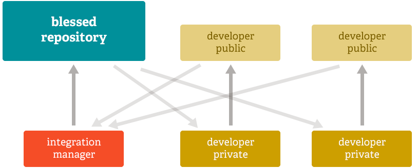

+++
title = "分布式"
weight = 30
type = "docs"
date = 2023-07-26T09:47:23+08:00
description = ""
isCJKLanguage = true
draft = false
+++

# Distributed - 分布式

[https://git-scm.com/about/distributed](https://git-scm.com/about/distributed)

​	任何分布式版本控制系统(包括 Git)最好的功能之一就是分布式。这意味着，与其 **检出(checkout)** 源代码的当前版本，你可以 **克隆(clone)** 整个仓库。

## 多重备份

​	这意味着即使你使用集中式工作流，每个用户本质上都有主服务器的完整备份。这些副本中的每一个都可以在崩溃或损坏的情况下被推送上来取代主服务器。实际上，除非仓库只有一个副本，否则 Git 没有单点故障。

## 任何工作流 

​	由于 Git 的分布式特性和出色的分支系统，可以相对容易地实现几乎无数种工作流。

### Subversion 风格的工作流

​	集中式工作流非常常见，特别是对于从集中式系统转换的人们。Git 不允许你推送，如果有人在你上次获取以后已经推送过，所以所有开发者都将代码推送到同一台服务器的集中式模型就可以正常工作。

工作流A
{: caption }

### 集成管理器工作流

​	另一种常见的 Git 工作流涉及集成管理器——由一个单独的人，负责向"受保护(blessed)"的仓库提交代码。一些开发者随后从该仓库进行克隆，推送到自己的独立仓库，并要求集成管理员合并他们的更改。这是常见于开源或 GitHub 仓库的开发模型。

工作流程B
{: caption }

### 独裁者和部下工作流 Dictator and Lieutenants Workflow 

​	对于更大规模的项目，通常采用类似于 Linux 内核的开发工作流。在这种模型中，一些人("部下lieutenants")负责一个特定的子系统，他们合并所有与该子系统相关的更改。另一个集成管理员("独裁者dictator")可以只从他/她的部下那里拉取更改，然后推送到"受保护(blessed)"的仓库，然后每个人再从这个仓库进行克隆。

工作流程C
{: caption }