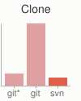
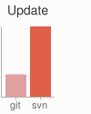
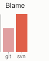
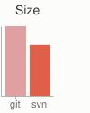

+++
title = "小而快"
weight = 20
type = "docs"
date = 2023-07-26T09:47:23+08:00
description = ""
isCJKLanguage = true
draft = false
+++

# Small and Fast - 小而快

[https://git-scm.com/about/small-and-fast](https://git-scm.com/about/small-and-fast)

​	**Git是快速的**。有了Git，几乎所有的操作都是在本地进行的，这使得它比那些必须不断与某处的服务器进行通信的集中式系统具有巨大的速度优势。

​	Git是为Linux内核构建的，这意味着它从一开始就必须有效地处理大型存储库。Git是用C语言编写的，减少了与高级语言相关的运行时开销。速度和性能一直是Git的主要设计目标。

## 基准测试

​	让我们看看常见操作与Subversion相比较，Subversion是一种类似于CVS或Perforce的常见中心化版本控制系统。越小越快。

|  |  |  |  |  |  |
| ------------------------------------------------------------ | ------------------------------------------------------------ | ------------------------------------------------------------ | ------------------------------------------------------------ | ------------------------------------------------------------ | ------------------------------------------------------------ |
| ) | ) | ) |  |  |                |

​	为测试，在同一可用区设置了大型AWS实例。在两台机器上安装了Git和SVN，将Ruby存储库复制到了Git和SVN服务器上，并在两个系统上执行了常见操作。

​	在某些情况下，命令并不完全匹配。在这里，尝试匹配最低公共分母。例如，“commit”测试还包括Git的推送时间，尽管大多数情况下您实际上不会在提交之后立即将其推送到服务器，这两个命令在SVN中不能分开。

​	所有这些时间都以秒为单位。

| Operation         |                                                         | Git  |  SVN   |      |
| ----------------- | ------------------------------------------------------- | :--: | :----: | ---- |
| Commit Files (A)  | add、commit 并push 113个修改过的文件（2164+，2259-）    | 0.64 |  2.60  | 4x   |
| Commit Images (B) | add、commit 并push1000个1 kB的图片                      | 1.53 | 24.70  | 16x  |
| Diff Current      | diff 187 个修改过的文件 (1664+, 4859-) 对照最后一次提交 | 0.25 |  1.09  | 4x   |
| Diff Recent       | 与4个提交进行比较（269个更改/3609+，6898-）             | 0.25 |  3.99  | 16x  |
| Diff Tags         | 将两个标记相互比较（v1.9.1.0/v1.9.3.0）                 | 1.17 | 83.57  | 71x  |
| Log (50)          | 最近50个提交的日志（19KB输出）                          | 0.01 |  0.38  | 31x  |
| Log (All)         | 所有提交的日志（26,056个提交-9.4MB的输出）              | 0.52 | 169.20 | 325x |
| Log (File)        | 单个文件的历史记录（array.c-483个版本）                 | 0.60 | 82.84  | 138x |
| Update            | 拉取提交A的情景（113个更改的文件，2164+，2259-）        | 0.90 |  2.82  | 3x   |
| Blame             | 单个文件（array.c）的行注释                             | 1.91 |  3.04  | 1x   |

​	请注意，这是SVN的最佳情况，即服务器没有负载，与客户机器之间有千兆连接。如果该连接速度更慢，几乎所有这些时间对于SVN都会更糟糕，而许多Git的时间则不受影响。

​	显然，在许多常见的版本控制操作中，即使对于SVN的理想条件，**Git也比SVN快一个或两个数量级**。

​	Git较慢的一个地方是初始克隆操作。在这里，Git正在下载整个历史记录，而不仅仅是最新版本。如上图所示，对于仅执行一次的操作，它的速度并没有明显的慢。

| Operation |                                                   | Git* |  Git  |  SVN  |
| --------- | ------------------------------------------------- | :--: | :---: | :---: |
| Clone     | 在Git中克隆和浅克隆（`*`）与在SVN中检出           | 21.0 | 107.5 | 14.0  |
| Size (MB) | 克隆/检出后客户端数据和文件的总大小（以MB为单位） |      | 181.0 | 132.0 |

​	另外值得注意的是，尽管Git也具有整个项目历史中每个文件的每个版本，但客户端数据的大小非常相似。这说明了它在客户端上的压缩和存储数据的高效性。